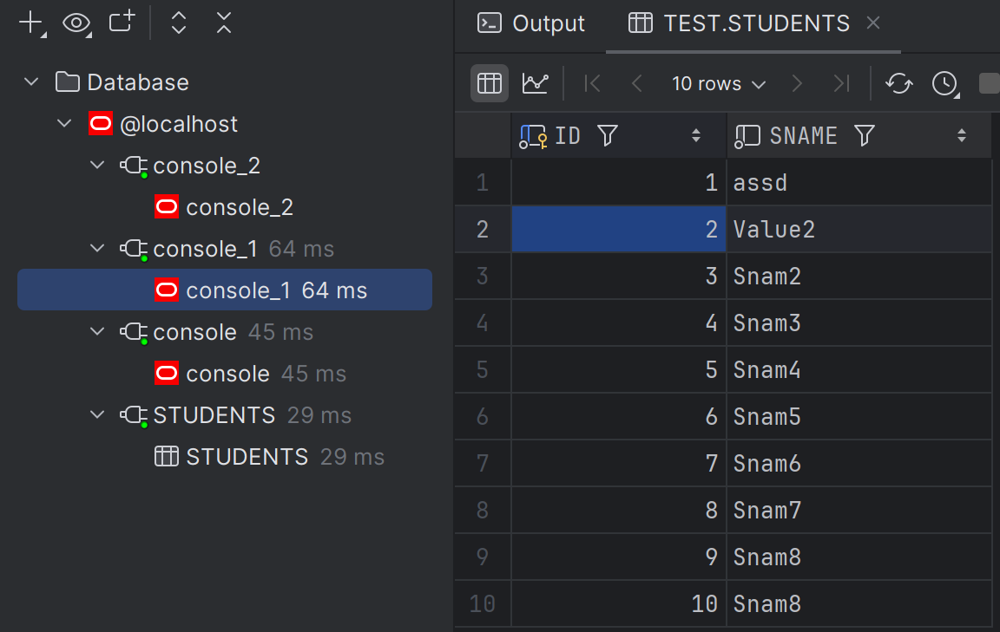

# Відпрацювання лекції 9

Відкриємо сесію в консолі 2 та оновимо SNAME в таблиці Students:
 ```oraclesqlplus
 UPDATE STUDENTS SET SNAME='Value1' WHERE ID=2;
 ```
Виберемо таблицю в поточній сесії:


Як бачимо значення змінилось.
Тепер виберемо таблицю через DataGrip:

Як можна побачити значення не змінились, тому-що не зроблений коміт.

Тепер спробуємо оновити той самий рядок, але вже в іншій сесії, через консоль 1.
 ```oraclesqlplus
 UPDATE STUDENTS SET SNAME='Value2' WHERE ID=2;
 ```
Результати:


Як можна побачити, цей запит заблокований оскільки консоль 2 не завершила роботу над цим рядком, 
щоб його розблокувати зробимо коміт




Як можна побачити ресурс розблокувався, і був виконаний UPDATE.

Виконаємо DEADLOCK:
Консоль 1:

Консоль 2:


Спробуємо оновити в консолі 1, рядок зайнятий сесією в консолі 2:
 ```oraclesqlplus
 UPDATE STUDENTS SET SNAME='Value30' WHERE ID=2;
 ```
A в консолі 2 спробуємо оновити рядок зайнятий сесією в консолі 1:
 ```oraclesqlplus
 UPDATE STUDENTS SET SNAME='Value40' WHERE ID=1;
 ```

В результаті отримали DEADLOCK:


Зробимо rollback:


Бачимо ресурс звільнився, та ми можемо зробити commit в консолі 2:
